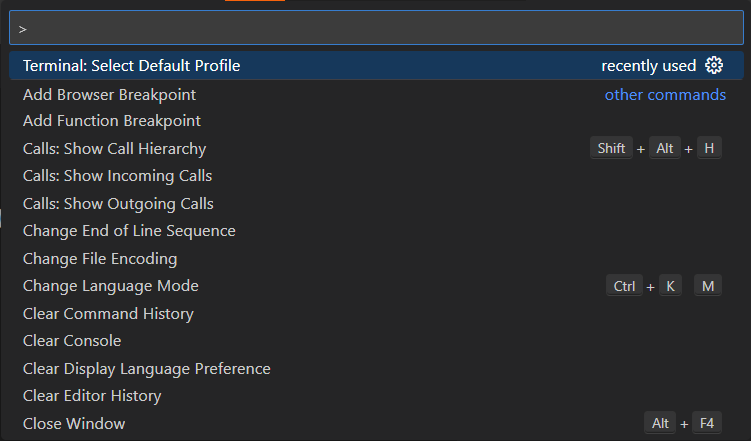

# Week 1 Lab Report - Abel Preciado
***
## Getting My CSE 15L Account Username
In order to get my CSE 15L account, I proceeded to this [link](https://sdacs.ucsd.edu/~icc/index.php). After logging in with my username and PID, the site listed out my CSE 15L account under "Additional Accounts". After setting the password for the account by clicking on the account name and using the Global Password Change tool, I had full access to my CSE 15L account.

## Installing Visual Studio Code (VS Code)
To install visual studio code, I had to go to this [link](https://code.visualstudio.com/) which would allow me to install the correct version for my laptop. I had already done this before, so I didn't need to install it at the time. I opened up VS Code from my desktop just to confirm that I still had it installed correctly. When I opened the application, I was met with this screen:

## Remote Connection
Since I was working on a Windows laptop, I first had to install git before I could try to remotely connect to any computer. I went to this [link](https://gitforwindows.org/) to install git for my laptop. After running the downloaded file and keeping all settings to their default selection, I had successfully installed git! Next, I had to set VS Code to use Bash as the default for terminal windows since that was the only way I could remotely connect. I opened VS Code and hit `Ctrl + Shift + P` at the same time to get this menu to open at the top of my tab:

In this menu, I typed "Select Default Profile" and selected it. It opened another menu that looked like this:

I selected "Git Bash" in order to tell VS Code to default to that setting whenever I opened a new terminal window. Now that I had set Bash to be my default terminal, I was ready to remotely connect to a CSE computer. I opened a new terminal using `` Ctrl + ` `` in VS Code. I confirmed that I had setup Bash correctly by looking at the first line of the terminal along with looking to see the type of terminal window by looking in the top right corner. 

I then proceeded to type `ssh cs15lwi23awg@ieng6.ucsd.edu` into the terminal and hit enter. It then asked me for my password which after typing in (note: nothing will show up when typing in your password) allowed me to connect successfully as seen below.

Note: If it is the first time trying a remote connection, it will ask if you want to trust the source. Simply type `yes` to allow it.

## Running Commands
After successfully connecting, I decided to run the `ls` command so that I could see everything in the current directory. I was met with only one item:

I also ran `pwd` to see where I was on the system, which returned me with the absolute path `/home/linux/ieng6/cs15lwi23/cs15lwi23awg`. I also ran `ls -lat` and `ls -a` to see the differences between those two commands and the standard `ls` command:

To make a new directory, I used the `mkdir hello` command. After running that command, I checked to see if the directory was created with the `ls` command, which I could see was the case:

I also tried making a new directory on a terminal that wasn't remotely connected to another computer. In this case, I created the directory on my personal laptop, which I could see in my File Explorer:

To finish my exploration of commands, I ran the command `cp /home/linux/ieng6/cs15lwi23/public/hello.txt ~/`, which allowed me to copy a file to my personal directory. I read the file two different ways, first by runnning `cat /home/linux/ieng6/cs15lwi23/public/hello.txt` and then `cat hello.txt`. Both resulted in the same text being printed, since they were the same file just in different places. 

I logged off with `Ctrl + d` to exit the remote session.
