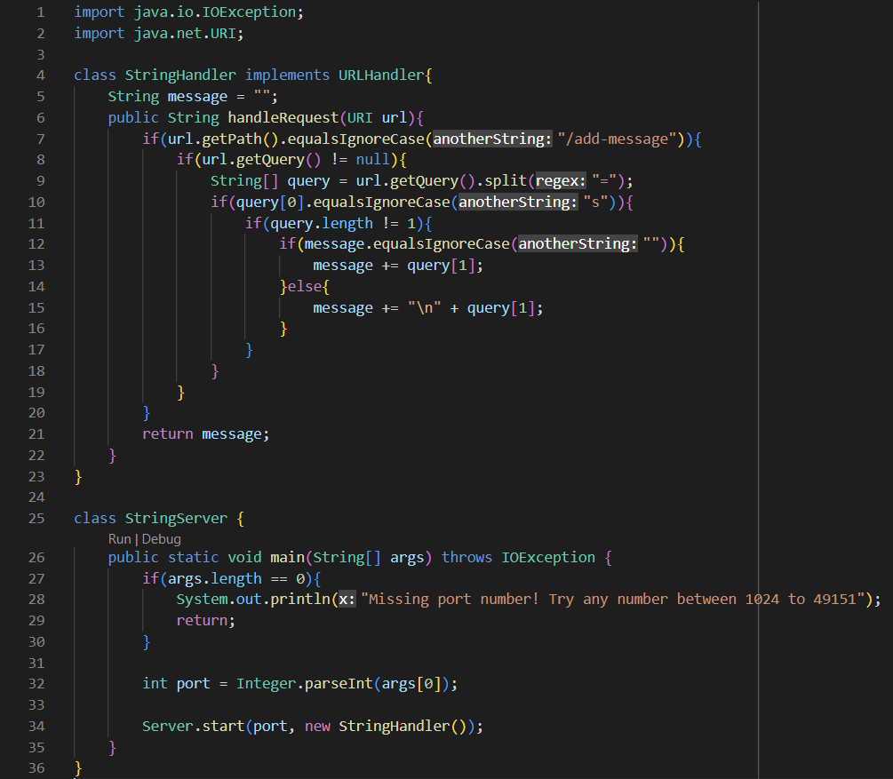
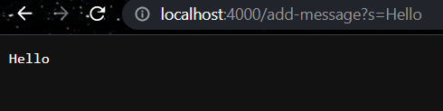
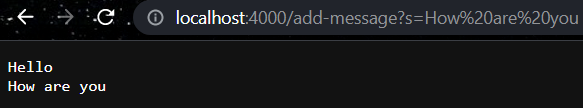

# Part 1 - Server
## StringServer Code

## Using `/add-message`
### `/add-message?s=Hello`

The first method called is the `handleRequest` method in the `StringHandler` class. The provided argument is `localhost:4000/add-message?s=Hello`, which is of type `URI` and is labeled `url`. At this point, the instance variable `message` is still at its initial value: `""`. We can then list out the next methods below:

- First `if` statement: `getPath` is called from the `url` object, it returns `"/add-message"`. Next method called is `equalsIgnoreCase` which has argument `"/add-message"`, comparing the message from `getPath` with the argument. This evaluates to `true`.
- Second `if` statement: `getQuery` is called from the `url` object, it returns `"s=Hello"`. A local string array `query` is created with values from splitting the query with `=`, provided by the `split` method with argument `"="`. Then, `query` is therefore set to `{"s", "Hello"}`.
- Third `if` statement: compares the first string in the `query` array with `"s"` by using the `equalsIgnoreCase` method with argument `"s"`. This evaluates to `true`.
- Fourth `if` statement: no methods called, checks length of `query` array to ensure there is a value after the `"="` sign. This evaluates to `true`.
- Fifth `if` statement: instance variable `message` is checked to see if empty by using the `equalsIgnoreCase` method with argument `""`. Since this is true for this query, `"Hello"` is added to the instance variable `message`, making `message = "Hello"`. 

Overall, the only field changed in the class was `message`, which was changed from `""` to `"Hello"`.
### `/add-message?s=How are you`

The first method called is the `handleRequest` method in the `StringHandler` class. The provided argument is `localhost:4000/add-message?s=How are you`, which is of type `URI` and is labeled `url`. At this point, the instance variable `message` is at the value of `"Hello"`. We can then list out the next methods below:

- First `if` statement: `getPath` is called from the `url` object, it returns `"/add-message"`. Next method called is `equalsIgnoreCase` which has argument `"/add-message"`, comparing the message from `getPath` with the argument. This evaluates to `true`.
- Second `if` statement: `getQuery` is called from the `url` object, it returns `"s=Hello"`. A local string array `query` is created with values from splitting the query with `=`, provided by the `split` method with argument `"="`. Then, `query` is therefore set to `{"s", "How are you"}`.
- Third `if` statement: compares the first string in the `query` array with `"s"` by using the `equalsIgnoreCase` method with argument `"s"`. This evaluates to `true`.
- Fourth `if` statement: no methods called, checks length of `query` array to ensure there is a value after the `"="` sign. This evaluates to `true`.
- Fifth `if` statement: instance variable `message` is checked to see if empty by using the `equalsIgnoreCase` method with argument `""`. Since this is false for this query, `"\n" + "How are you"` is added to the instance variable `message`, making `message = "Hello\nHow are you"`. 

Overall, the only field changed in the class was `message`, which was changed from `"Hello"` to `"Hello\nHow are you"`.

# Part 2 - Bugs

# Part 3 - Something Learned
Mainly in week 2, I learned a lot more about webpages, URL's, and the ability for Java to host a webserver. I was previously aware of the "different parts" of a URL, but I didn't know what their names such as "query" and "path". I was also unaware that Java alone could be used to host a webserver on its own. I also learned about different parameters of the `javac` command and the `java` command.
