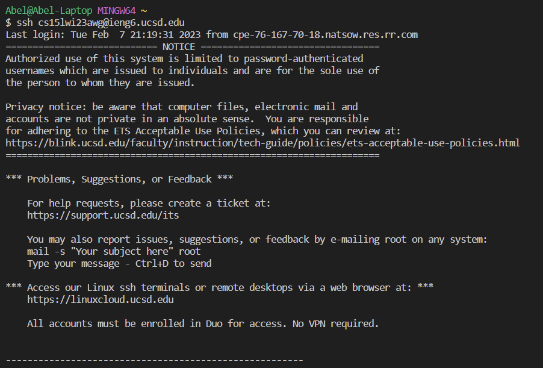
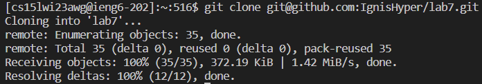
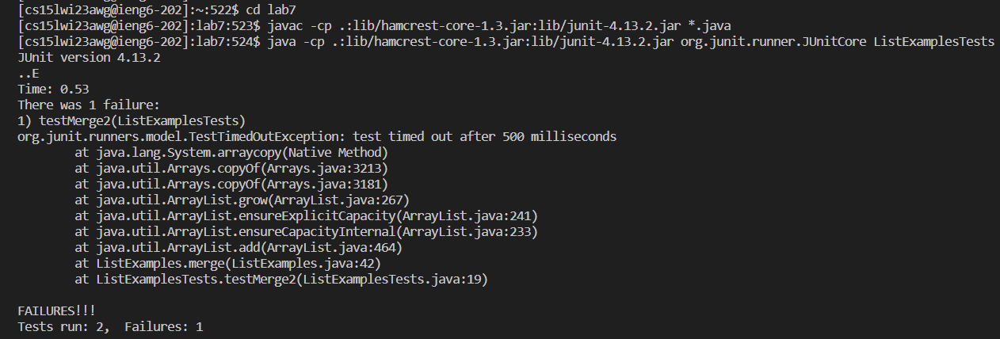
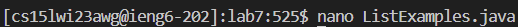
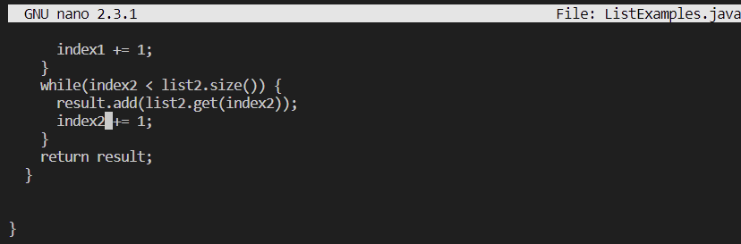
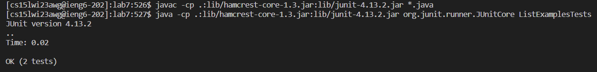
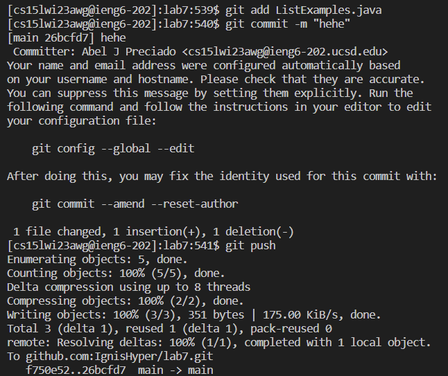

# Week 6/7 Lab Report - Abel Preciado
## Step 4

Keys Pressed: `<control> + r`, `s`, `<enter>`

The `ssh cs15lwi23awg@ieng6.ucsd.edu` command was the first command after hitting `s` in the command recall terminal command, all I had to do was hit `<enter>` to login. Additionally, since we set up the ssh key for our account, I didn't have to enter my password to login.

## Step 5

Keys Pressed: `<control> + r`, `git c`, `<enter>`

Similar to the previous step, I used `<control> + r` to search for a previously entered command that matched my input of `git c`. It found the clone command, `git clone git@github.com:IgnisHyper/lab7.git` that was previously used to clone my forked repository. All I had to do was hit `<enter>` to execute the command.

## Step 6

Keys Pressed: `cd lab7 <enter>`, `<control> + r`, `javac `, `<enter>`, `<control> + r`, `java `, `<enter>`

I first has to `cd` into the `lab7` directory that was cloned onto the machine. Next, I used `<control> + r` plus `javac ` to compile and then `<control> + r` plus `java ` to run the tests and show that the tests failed.

## Step 7

Keys Pressed: `nano Li<tab>.j<tab> <enter>`, `<Page Down><down><down><down><down><right><right><right><right><right><right><right><right><right><right><right><backspace>2`, `<control> + o`, `<enter>`, `<control> + x`

I used the tab auto-complete to automatically fill the file name for the `nano` command. In the `nano` menu, I used `<Page Down>` to get to the second page of the code, then I used multiple `<down>` and `<right>` arrow key presses to get to the error in the code. I fixed the code by hitting `<backspace>` and entering `2`, then used `<control> + o` to save, and `<control> + x` to exit.

## Step 8

Keys Pressed: `<up><up><up><enter>`, `<up><up><up><enter>`

Since the commands to compile and run the tests were just ran, I used three presses of the `<up>` key to get to the command through the history. After the compile command was ran, the `java` command moves to its place in the history which is why we can use the same number of key presses of `<up>` to get to the command.

## Step 9

Keys Pressed: `git add L<tab>.j<tab> <enter>`, `git commit -m "hehe" <enter>`, `git push <enter>`

Since these commands are shorter and easy to remember and type, I manually typed in the commands with the exception of using the auto-complete to fill in the `ListExamples.java` in the `git add` command.

