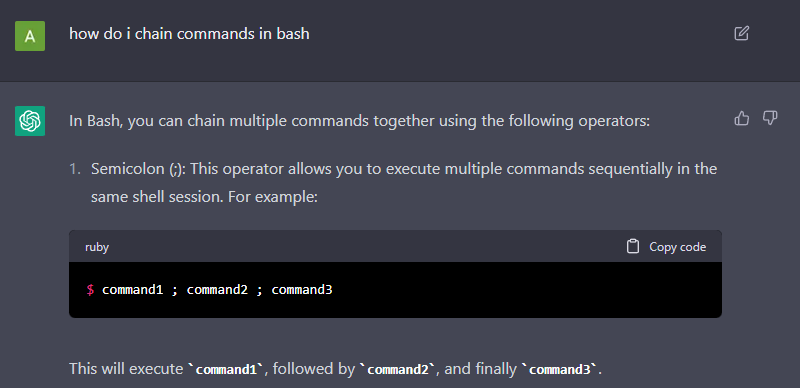

# Lab Report 5 - Abel Preciado
## Selected Lab / Report: Lab Week 7 / Report 4, Doing commands quickly
### Background Information
This lab was focused on speeding up the process of working in the terminal. We were given multiple ways to speed up our work flow, mainly through setting up an `ssh` key so that we didn't have to type our password in everytime to login to ieng6, in addition to instruction regarding using `<tab>` and searching through our command history. While at first I was quite slow at completing all the tasks, taking around 3-5 minutes to complete them all (if I recall correctly), I was able to get it down to under 15 seconds after consulting with my lab members and section tutor regarding some common tricks. With a bash script, I could only assume it would be just as fast if not faster then my previous best time, which I will test later in this report.

### How I got under 15 seconds
To minimize the amount of time spent, I minimized the amount of time spent actually typing commands. After my section tutor informed us of a student in another section who managed to get under 30 seconds through command chaining, I consulted ChatGPT on how that was done in bash. ChatGPT returned with this information:

With that in mind, I started working on chaining commands together. I knew that using `ssh` to login to the server would have to remain its own command, since if I tried to chain commands after `ssh`, they wouldn't be executed on the remote server and instead would wait until I logged out and returned to my local terminal. Additionally, I wasn't aware of a way to alter text directly in the command line, so I would still have to use `nano` to manually edit the file in step 7, but steps 5-6 and 8-9 I could chain together, reducing the total number of commands ran to just 4 commands, instead of the previous 11 commands. The commands I ran are listed below:
* `ssh cs15lwi23awg@ieng6.ucsd.edu`
* `git clone git@github.com:IgnisHyper/lab7.git; cd lab7; javac -cp .:lib/hamcrest-core-1.3.jar:lib/junit-4.13.2.jar *.java; java -cp .:lib/hamcrest-core-1.3.jar:lib/junit-4.13.2.jar org.junit.runner.JUnitCore ListExamplesTests`
* `nano ListExamples.java`
* `javac -cp .:lib/hamcrest-core-1.3.jar:lib/junit-4.13.2.jar *.java; java -cp .:lib/hamcrest-core-1.3.jar:lib/junit-4.13.2.jar org.junit.runner.JUnitCore ListExamplesTests; git add ListExamples.java; git commit -m "hehe"; git push`

These commands allowed me to reduce my time quite a bit, but I still wasn't satisfied. I returned to ChatGPT and asked it about altering text directly in the command line without having to use `nano` or `vim`. ChatGPT replied with this response:

The `sed` command was the command that seemed most fitting for my purposes. I proceeded to further ask ChatGPT about how to alter text on a specific line:

After some experiments with changing lines using `sed`, along with determining the proper line number, I came up with the command `sed -i '43s/.*/      index2 += 1;/' ListExamples.java` which successfully altered the buggy line in `ListExamples.java` to the fixed line, meaning I would no longer need to use `nano` to manually fix the bug! With that in mind, I managed to just have to run two commands:
* `ssh cs15lwi23awg@ieng6.ucsd.edu`
* `git clone git@github.com:IgnisHyper/lab7.git; cd lab7; javac -cp .:lib/hamcrest-core-1.3.jar:lib/junit-4.13.2.jar *.java; java -cp .:lib/hamcrest-core-1.3.jar:lib/junit-4.13.2.jar org.junit.runner.JUnitCore ListExamplesTests; sed -i '43s/.*/      index2 += 1;/' ListExamples.java; javac -cp .:lib/hamcrest-core-1.3.jar:lib/junit-4.13.2.jar *.java; java -cp .:lib/hamcrest-core-1.3.jar:lib/junit-4.13.2.jar org.junit.runner.JUnitCore ListExamplesTests; git add ListExamples.java; git commit -m "hehe"; git push`

I'll note that I ran these commands before both on my laptop and on the remote server so that I could easily search for them using the `<ctrl> + r` command search shortcut, bring my time down even more. It may not be the prettiest command in the world, and any other developer who tried to read it may struggle, but it allowed me to get my total time to around 10 seconds (if I recall correctly)!

### Using a `bash` script
Using a `bash` script would have been helpful for two main reasons:
1. It would be easier to debug
2. It would be easier to read

I decided to not create a `bash` script for running the `ssh` command, since its a singular command that I have to run locally. The second, longer, command I would definitely place in a `bash` script. I went ahead and logged onto the remote server to do this actually. I started by running the command `touch speedrun.sh` to create a `bash` script where I could place all my commands. I then proceeded to copy the long command from my command history (found using the `history` command). I opened `speedrun.sh` using `nano speedrun.sh` and pasted the long command. It sadly pasted as one long line, so I went through and broke apart the line for readability. I ran `<ctrl> + o` and `<ctrl> + x` to save my script and quit `nano`. I ran the script once just to place it in my command history and then reset my account and fork so that I could test it. My new `bash` script was as follows:

My new command list would be as follows:
* `ssh cs15lwi23awg@ieng6.ucsd.edu`
* `bash speedrun.sh`

Much cleaner! After timing myself with strategy, I got 9.81 seconds! A minor improvement, but an improvement never the less. 

### Closing thoughts
Overall, while the `bash` script didn't neccessarily improve my time significantly, it definitely helped improve readability and would have helped with debugging when writing all the commands to be ran. Most, if not all, of the time was actually spent just waiting for the commands to run. The only way I could think of to speed up this process would be running multiple commands at once instead of after one another. However, most of the commands are meant to be ran one after another, plus, I am unsure if that would cause a significant increase in speed. ChatGPT did provide this concept earlier when asked about chaining commands, but I feel that is an experiment for another day. This activity was quite fun and enjoyable, especially with trying to push the time as low as possible to the point where the limitation is just waiting for the commands to run!
